# Hi! 👋😊 Chào mừng đến với góc học tập nhỏ của mình!!!
## 📜BTapAndroid_65CLC
Đây là nơi mình sẽ lưu bài tập, bài thực hành trong quá trình học môn lập trình di động.
## 🟡 1. [Hello Android](https://github.com/NguyenTruong4028/BTapAndroid_65CLC/tree/main/HelloAndroid)
- Đây là bản demo đầu tiên cho học phần lập trình di động. Bản demo chỉ hiện mỗi chữ "Hello Android"
## 🟡 2. [ViDuLayout1](https://github.com/NguyenTruong4028/BTapAndroid_65CLC/tree/main/ViDuLayout1)
- Đây là bài tập giúp tập làm quen với 'constraintlayout'.
## 🟡 3. [LoginScreenFigma](https://github.com/NguyenTruong4028/BTapAndroid_65CLC/tree/main/LoginScreenFigma)
- Đây là bài tập thiết kế giao diện Sign Up theo yêu cầu, dựa trên [Figma](https://www.figma.com/design/C1QQx0QZnwo92jn8tlk49B/Untitled?node-id=0-1&p=f&t=n78BPuQvFeY7WUXO-0)
- Giao diện gốc và giao diện đã làm:

|Gốc|Đã làm|Cập nhật|
|---|------|--------|
|  |  | |

## 🟡 4. [About me](https://github.com/NguyenTruong4028/BTapAndroid_65CLC/tree/main/AboutMe)
- Đây là bài tập thiết kế giao diện về giới thiệu bản thân theo mẫu [Figma]([https://www.figma.com/design/C1QQx0QZnwo92jn8tlk49B/Untitled?node-id=0-1&p=f&t=n78BPuQvFeY7WUXO-0](https://github.com/NguyenTruong4028/BTapAndroid_65CLC/tree/main/lamthemWeather))
- Giao diện gốc và giao diện đã làm:

|Gốc|Đã làm|
|---|------|
|  |  |

## 🟡 5. [lamthemWeather](https://github.com/NguyenTruong4028/BTapAndroid_65CLC/tree/main/AboutMe)
- Đây là bài tập nhỏ mình làm thêm về thiết kế giao diện dự báo thời tiết [Figma](https://www.figma.com/design/C1QQx0QZnwo92jn8tlk49B/Untitled?node-id=0-1&p=f&t=n78BPuQvFeY7WUXO-0)

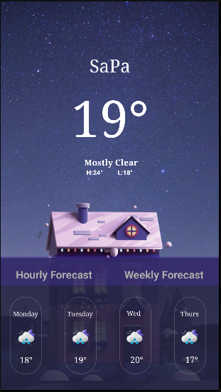

## 🟡 6. [ViduLayout2](https://github.com/NguyenTruong4028/BTapAndroid_65CLC/tree/main/ViduLayout2)
- Ví dụ này là hướng dẫn cách dùng linear layout cũng như là thiết lập giao diện bằng code.

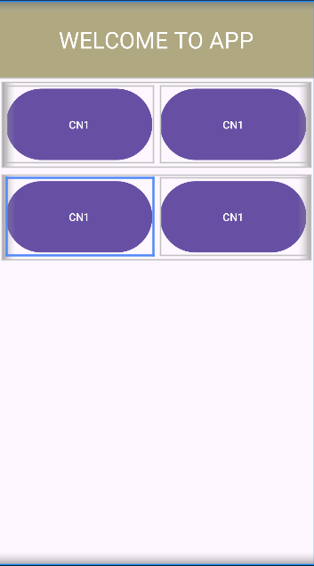

## 🟡 7. [Cộng 2 số](https://github.com/NguyenTruong4028/BTapAndroid_65CLC/tree/main/TinhTong2So)
- Ứng dụng tính toán cộng 2 số cơ bản.

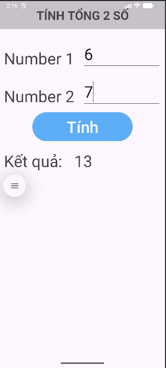

## 🟡 8. [Phép toán](https://github.com/NguyenTruong4028/BTapAndroid_65CLC/tree/main/PhepToanSoHoc)
- Ứng dụng tính toán các phép tính cộng trừ nhân chia cơ bản.

|Chức năng|Giao diện|Cộng|Trừ|Nhân|Chia|
|---------|---------|----|---|----|----|
|Minh họa|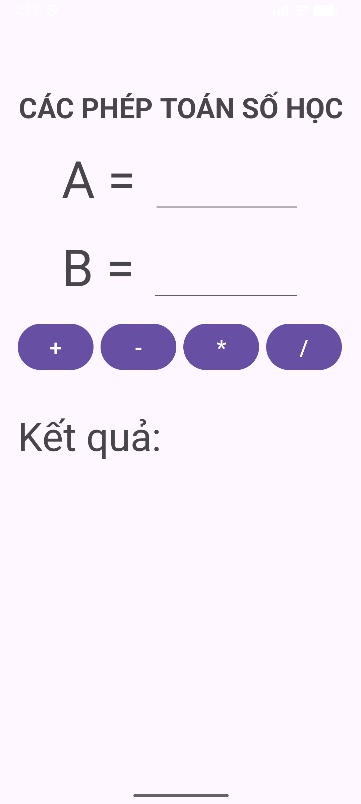|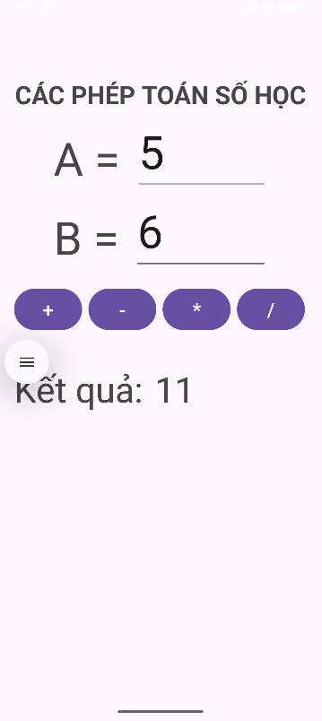|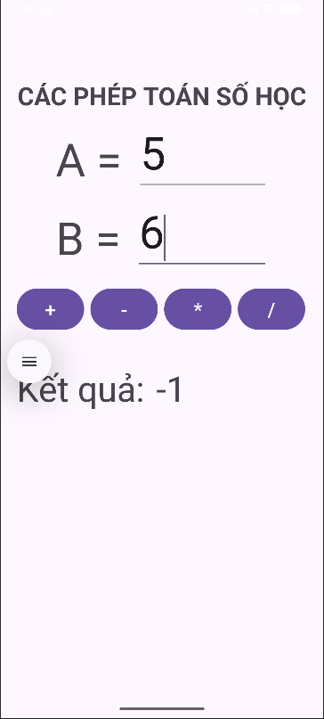|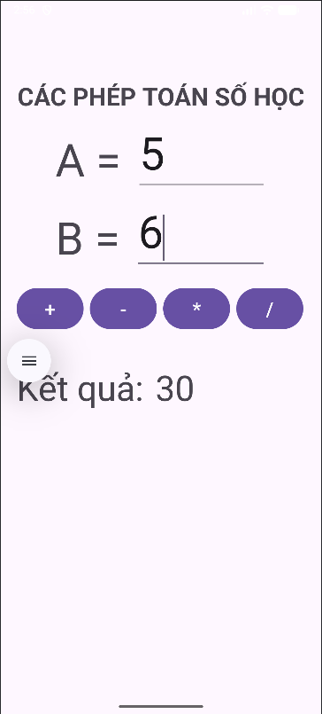|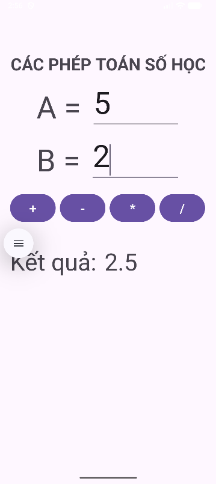|

## 🟡 9. [lamthem Trắc Nghiệm Tính Cộng 2 Số](https://github.com/NguyenTruong4028/BTapAndroid_65CLC/tree/mainlamthemTNPhepToanCong)
- Ứng dụng sinh câu hỏi trắc nghiệm tính cộng cơ bản. Bao gồm các tính năng sau:
    + Sinh câu hỏi tự động ngẫu nhiên có đáp án < 100.
    + Cộng điểm cho đáp án đúng và trừ điểm cho đáp án sai.
    + Tính thời gian trả lời câu hỏi.

|Chức năng|Giao diện|Đáp án đúng|Đáp án sai|Hết thời gian|
|---------|---------|----|---|----|
|Minh họa|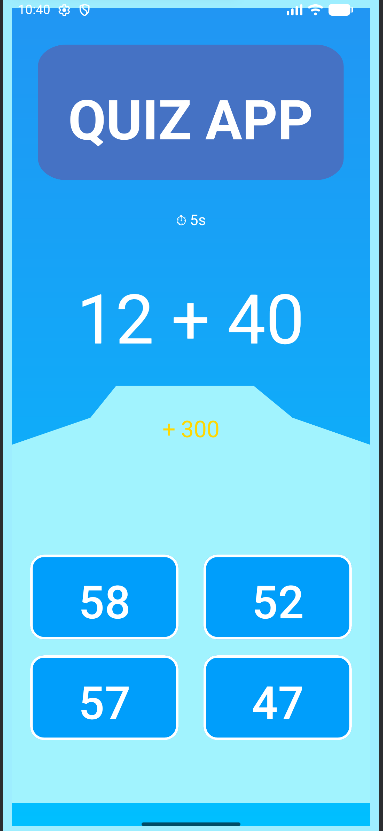|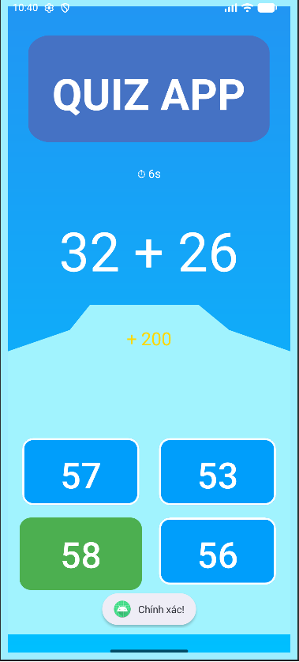|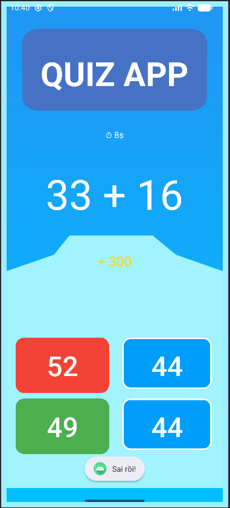|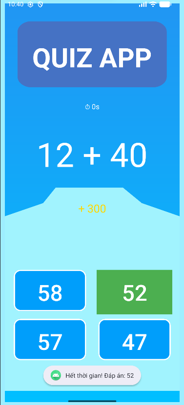|

## 🟡 10. [Chuyển đổi ngoại tệ USD -> VND](https://github.com/NguyenTruong4028/BTapAndroid_65CLC/tree/main/ChuyenDoiNgoaiTe)
- Ứng dụng chuyển đổi tiền tệ cơ bản từ USD -> VND. Chưa call API
- [Những kiến thức đã học được từ ứng dụng này!](./ChuyenDoiNgoaiTe/kienthuchocduoc.md)

<video width="640" height="480" controls>
  <source src="./img/TienTe/TienTe.webm" type="video/webm">
  Trình duyệt của bạn không hỗ trợ thẻ video.
</video>

## 🟡 10. [BMI Calculator](https://github.com/NguyenTruong4028/BTapAndroid_65CLC/tree/main/BMI_Calculator)
- Ứng dụng tính BMI và in ra kết quả theo tiêu chuẩn người Châu Á và tiêu chuẩn WHO.
- [Những kiến thức đã học được từ ứng dụng này!](./BMI_Calculator/kienthuchocduoc.md)

<video width="640" height="480" controls>
  <source src="./img/TienTe/TienTe.webm" type="video/mp4">
  Trình duyệt của bạn không hỗ trợ thẻ video.
</video>

